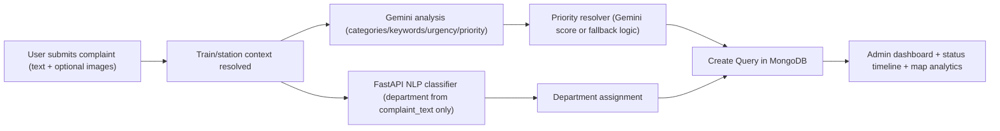

# RailMind (Vega_2026)

AI-powered railway complaint management platform with role-based access, mobile complaint flows, admin analytics, and station-wise map visualization.

## Project Overview

RailMind allows passengers to raise railway complaints with optional images, auto-analyzes the issue using Gemini + FastAPI NLP, assigns priority and department, and enables admins to track and update complaint status in real time.

## Implemented Features (PS Coverage)

### 1) Role-Based Authentication and Authorization

- JWT-based auth (`/api/auth/login`, `/api/auth/register`, `/api/auth/check`)
- Roles supported:
  - `admin`
  - `super admin`
  - `user`
- Role-aware login redirects:
  - `admin` / `super admin` -> `/`
  - `user` -> `/mobile`
- Role normalization handles `super_admin` and `super admin`
- Protected APIs via JWT middleware
- Admin/Super Admin guarded APIs:
  - Update query status
  - Station map analytics endpoint

### 2) Global Profile Dropdown

- Profile dropdown added across key pages (dashboard, queries, map, mobile pages, chat)
- Includes:
  - User info and role
  - Role-based home navigation
  - Admin quick links (Dashboard, Map)
- Mobile-friendly dropdown behavior and sizing adjustments

### 3) Mobile Complaint Management

- User mobile landing: `/mobile`
- Complaint form: `/mobile/complaint`
  - Train validation by train number
  - Station selection from train route
  - Image upload (up to 5 images)
- My Issues page: `/mobile/issues`
  - Shows status, priority, department, keywords
- Test workflow page: `/mobile/test-complaint`
  - Step-by-step pipeline visibility (input -> Gemini -> NLP -> output)

### 4) AI + NLP Complaint Processing Pipeline

- Gemini used for:
  - Categories
  - Keywords
  - Urgency signal
  - Optional priority score
- FastAPI NLP classifier used for:
  - Department prediction (single source of truth)
- NLP payload is text-only:
  - `{ "complaint_text": "<description>" }`
- Gemini and NLP calls run in parallel for lower latency
- If Gemini fails (for example quota/rate limit), system falls back gracefully and still creates complaint
- Priority logic:
  - Uses Gemini score if valid
  - Otherwise falls back to rules-based calculation

### 5) Query Lifecycle and Admin Status Control

- Query statuses:
  - `received`, `assigned`, `working_on`, `hold`, `pending_info`, `escalated`, `resolved`, `closed`, `rejected`
- Admin/Super Admin can update status from View Queries page
- Status history stored with:
  - `status`
  - `changed_by`
  - `changed_at`
  - `remarks`
- Visual status timeline in query cards:
  - Completed steps show check indicators
  - Current step highlighted with status color

### 6) View Queries Page Enhancements

- Route: `/dashboard/queries`
- Search, filter, pagination
- Debounced search input (waits after typing before API call)
- Status-wise filtering
- Inline status update dropdown for admin/super admin

### 7) Station Map Visualization (Admin/Super Admin)

- New route: `/map`
- Role-gated frontend and backend access
- Uses station code in queries to aggregate station-level analytics
- Station geolocation lookup from station dataset (`stations.json`)
- Google Maps visualization with:
  - Color-coded markers by dominant status
  - Circle intensity by complaint count
  - Station info window (counts, avg priority, status breakdown)
  - Filters (`status`, `min_count`)
  - Ranked side panel for top stations
- Added navigation to map from:
  - Dashboard sidebar
  - Profile dropdown

### 8) Dashboard Analytics

- Route: `/dashboard`
- Metrics:
  - Total queries
  - Resolved / in-progress / pending
  - High-priority count
  - Average priority
- Visual distributions:
  - Status
  - Priority bands
  - Categories
  - Departments
  - Trains
  - Time-series trends
- Recent queries and keyword insights

### 9) Chat UI Module

- Route: `/chat`
- Multi-model styled conversational interface with modern UX components
- Profile dropdown integrated for consistent auth/session actions

---

## Role Access Matrix

| Feature | User | Admin | Super Admin |
|---|---:|---:|---:|
| Login/Register | Yes | Yes | Yes |
| Mobile complaint flow | Yes | Yes | Yes |
| View own issues | Yes | Yes | Yes |
| Dashboard access | Yes (auth) | Yes | Yes |
| Update query status | No | Yes | Yes |
| Station map page | No | Yes | Yes |
| Map API (`/queries/map/stations`) | No | Yes | Yes |

---

## Core Workflow



---

## API Summary

### Auth
- `POST /api/auth/register`
- `POST /api/auth/login`
- `GET /api/auth/check`

### Mobile
- `GET /api/mobile/train/:trainNumber`
- `GET /api/mobile/train/:trainNumber/schedule`
- `GET /api/mobile/train/:trainNumber/stations`
- `POST /api/mobile/complaint`
- `POST /api/mobile/complaint-with-gemini` (multipart form-data)
- `GET /api/mobile/complaints`

### Queries
- `GET /api/queries`
- `POST /api/queries`
- `GET /api/queries/:id`
- `PUT /api/queries/:id`
- `PATCH /api/queries/:id/status` (admin/super admin)
- `DELETE /api/queries/:id`
- `GET /api/queries/dashboard/statistics`
- `GET /api/queries/map/stations` (admin/super admin)

### Reference Data
- `GET /api/stations`
- `GET /api/trains`

---

## Tech Stack

### Frontend
- Next.js (App Router)
- React
- Tailwind CSS
- Framer Motion
- Recharts
- Google Maps JS API

### Backend
- Node.js + Express
- MongoDB + Mongoose
- JWT auth
- Multer + Cloudinary for images
- Gemini API integration

### NLP Service
- FastAPI
- scikit-learn classifier (`department_classifier.pkl`)

---

## Data Sources

- Train schedule and station sequence from CSV dataset
- Station geo metadata (lat/lng + properties) from station GeoJSON dataset
- Complaint/query data stored in MongoDB

---

## Environment Variables

### Server (`server/.env`)
- `MONGODB_URL`
- `SERVER_PORT`
- `ACCESS_TOKEN_SECRET`
- `GEMINI_API_KEY`
- `NLPPY_URL` or `NLP_URL`
- `CLOUDINARY_CLOUD_NAME`
- `CLOUDINARY_API_KEY`
- `CLOUDINARY_API_SECRET`
- `FRONTEND_URL`
- Optional email/google variables used by utilities

### Client (`client/.env.local`)
- `NEXT_PUBLIC_API_BASE_URL`
- `NEXT_PUBLIC_GOOGLE_MAPS_API_KEY`
- `NEXT_PUBLIC_GOOGLE_API_KEY` (fallback)
- `NEXT_PUBLIC_GOOGLE_CLIENT_ID` (if OAuth flow is used)

### NLP (`nlppy`)
- No mandatory env by default in current implementation (model file required)

---

## Local Setup

### 1) Start Backend
```bash
cd server
npm install
npm run dev
```

### 2) Start Frontend
```bash
cd client
npm install
npm run dev
```

### 3) Start NLP Service
```bash
cd nlppy
pip install -r requirements.txt
uvicorn app:app --host 0.0.0.0 --port 8002 --reload
```

Set `NLPPY_URL=http://localhost:8002` in server env.

---

## Current Folder Layout

```txt
client/   -> Next.js frontend
server/   -> Express API + MongoDB models/controllers/routes
nlppy/    -> FastAPI NLP classifier service
```

---

## License

Internal project / PS implementation.
